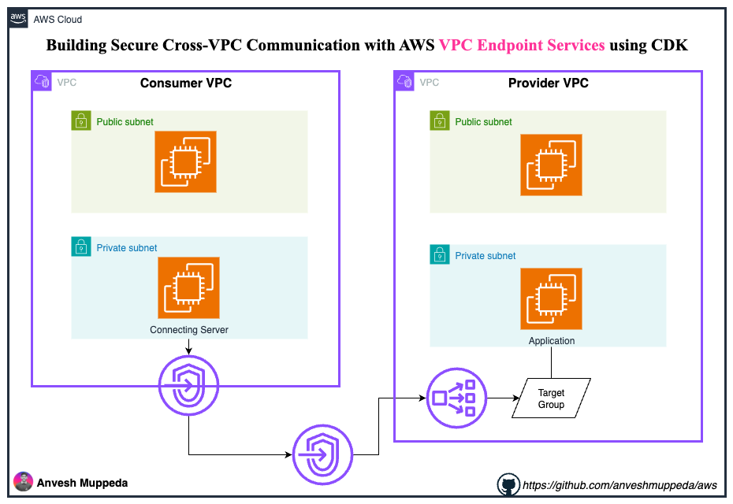

# Building Secure Cross-VPC Communication with AWS VPC Endpoint Services using CDK

## Introduction

In modern cloud architectures, securely connecting services across different VPCs without exposing traffic to the internet is crucial. AWS VPC Endpoint Services provide a powerful solution for private connectivity between VPCs. In this hands-on guide, we'll build a complete VPC Endpoint Service setup using AWS CDK with Python.



## What You'll Learn

- Understanding VPC Endpoint Services and their use cases
- Setting up provider and consumer VPCs with proper networking
- Creating a Network Load Balancer for the endpoint service
- Implementing VPC Endpoint Service with CDK
- Testing private connectivity between VPCs

## Architecture Overview

We'll create:
- **Provider VPC**: Hosts the service (web server behind NLB)
- **Consumer VPC**: Consumes the service via VPC endpoint
- **VPC Endpoint Service**: Enables private connectivity
- **Network Load Balancer**: Routes traffic to the service

## Prerequisites

- AWS CLI configured with appropriate permissions
- Python 3.8+ installed
- AWS CDK installed (`npm install -g aws-cdk`)
- An EC2 key pair named "demo" (or modify the code)

## Step 1: Project Setup

Create a new CDK project:

```bash
mkdir vpc-endpoint-service-lab
cd vpc-endpoint-service-lab
cdk init app --language python
```

Activate the virtual environment and install dependencies:

```bash
# On macOS/Linux
source .venv/bin/activate

# On Windows
.venv\Scripts\activate.bat

pip install -r requirements.txt
```

## Step 2: Update Requirements

Update `requirements.txt`:

```txt
aws-cdk-lib==2.179.0
constructs>=10.0.0,<11.0.0
```

## Step 3: Create the VPC Endpoint Service Stack

Replace the contents of `vpc_endpoint_service_stack.py`:

```python
from constructs import Construct
from aws_cdk import (
    Stack,
    CfnOutput,
    Fn,
    aws_ec2 as ec2,
    aws_elasticloadbalancingv2 as elbv2,
)

class VpcEndpointServiceStack(Stack):
    def __init__(self, scope: Construct, construct_id: str, **kwargs) -> None:
        super().__init__(scope, construct_id, **kwargs)
        
        # Configuration
        consumer_app_prefix = "consumer"
        provider_app_prefix = "provider"
        azs = ["us-east-1a", "us-east-1b"]

        ### CONSUMER VPC SETUP ###
        
        # Create Consumer VPC
        self.consumer_vpc = ec2.CfnVPC(
            self,
            "ConsumerVPC",
            cidr_block="10.10.0.0/16",
            enable_dns_hostnames=True,
            enable_dns_support=True,
            tags=[{"key": "Name", "value": f"{consumer_app_prefix}-vpc"}]
        )
        
        # Create Consumer Internet Gateway
        self.consumer_igw = ec2.CfnInternetGateway(
            self,
            "ConsumerInternetGateway",
            tags=[{"key": "Name", "value": f"{consumer_app_prefix}-igw"}]
        )
        
        # Attach Internet Gateway to Consumer VPC
        ec2.CfnVPCGatewayAttachment(
            self,
            "ConsumerIGWAttachment",
            vpc_id=self.consumer_vpc.vpc_id,
            internet_gateway_id=self.consumer_igw.ref
        )

        # Create Consumer Subnets
        self.consumer_public_subnets = []
        self.consumer_private_subnets = []
        
        for i, az in enumerate(azs):
            # Public subnets
            public_subnet = ec2.CfnSubnet(
                self,
                f"ConsumerPublicSubnet{i+1}",
                availability_zone=az,
                cidr_block=f"10.10.{i}.0/24",
                vpc_id=self.consumer_vpc.vpc_id,
                map_public_ip_on_launch=True,
                tags=[{"key": "Name", "value": f"{consumer_app_prefix}-public-subnet-{i+1}"}]
            )
            self.consumer_public_subnets.append(public_subnet)
            
            # Private subnets
            private_subnet = ec2.CfnSubnet(
                self,
                f"ConsumerPrivateSubnet{i+1}",
                availability_zone=az,
                cidr_block=f"10.10.{i+10}.0/24",
                vpc_id=self.consumer_vpc.vpc_id,
                map_public_ip_on_launch=False,
                tags=[{"key": "Name", "value": f"{consumer_app_prefix}-private-subnet-{i+1}"}]
            )
            self.consumer_private_subnets.append(private_subnet)
        
        # Create Consumer Route Tables
        consumer_public_rt = ec2.CfnRouteTable(
            self,
            "ConsumerPublicRouteTable",
            vpc_id=self.consumer_vpc.vpc_id,
            tags=[{"key": "Name", "value": f"{consumer_app_prefix}-public-rt"}]
        )
        
        consumer_private_rt = ec2.CfnRouteTable(
            self,
            "ConsumerPrivateRouteTable",
            vpc_id=self.consumer_vpc.vpc_id,
            tags=[{"key": "Name", "value": f"{consumer_app_prefix}-private-rt"}]
        )
        
        # Add route to Internet Gateway for public subnets
        ec2.CfnRoute(
            self,
            "ConsumerPublicRoute",
            route_table_id=consumer_public_rt.ref,
            destination_cidr_block="0.0.0.0/0",
            gateway_id=self.consumer_igw.ref
        )
        
        # Associate subnets with route tables
        for i, subnet in enumerate(self.consumer_public_subnets):
            ec2.CfnSubnetRouteTableAssociation(
                self,
                f"ConsumerPublicSubnetRTAssoc{i+1}",
                subnet_id=subnet.ref,
                route_table_id=consumer_public_rt.ref
            )
        
        for i, subnet in enumerate(self.consumer_private_subnets):
            ec2.CfnSubnetRouteTableAssociation(
                self,
                f"ConsumerPrivateSubnetRTAssoc{i+1}",
                subnet_id=subnet.ref,
                route_table_id=consumer_private_rt.ref
            )

        ### PROVIDER VPC SETUP ###
        
        # Create Provider VPC
        self.provider_vpc = ec2.CfnVPC(
            self,
            "ProviderVPC",
            cidr_block="10.20.0.0/16",
            enable_dns_hostnames=True,
            enable_dns_support=True,
            tags=[{"key": "Name", "value": f"{provider_app_prefix}-vpc"}]
        )
        
        # Create Provider Internet Gateway
        self.provider_igw = ec2.CfnInternetGateway(
            self,
            "ProviderInternetGateway",
            tags=[{"key": "Name", "value": f"{provider_app_prefix}-igw"}]
        )
        
        # Attach Internet Gateway to Provider VPC
        ec2.CfnVPCGatewayAttachment(
            self,
            "ProviderIGWAttachment",
            vpc_id=self.provider_vpc.vpc_id,
            internet_gateway_id=self.provider_igw.ref
        )

        # Create Provider Subnets
        self.provider_public_subnets = []
        self.provider_private_subnets = []
        
        for i, az in enumerate(azs):
            # Public subnets
            public_subnet = ec2.CfnSubnet(
                self,
                f"ProviderPublicSubnet{i+1}",
                availability_zone=az,
                cidr_block=f"10.20.{i}.0/24",
                vpc_id=self.provider_vpc.vpc_id,
                map_public_ip_on_launch=True,
                tags=[{"key": "Name", "value": f"{provider_app_prefix}-public-subnet-{i+1}"}]
            )
            self.provider_public_subnets.append(public_subnet)
            
            # Private subnets
            private_subnet = ec2.CfnSubnet(
                self,
                f"ProviderPrivateSubnet{i+1}",
                availability_zone=az,
                cidr_block=f"10.20.{i+10}.0/24",
                vpc_id=self.provider_vpc.vpc_id,
                map_public_ip_on_launch=False,
                tags=[{"key": "Name", "value": f"{provider_app_prefix}-private-subnet-{i+1}"}]
            )
            self.provider_private_subnets.append(private_subnet)

        # Create Provider Route Tables
        provider_public_rt = ec2.CfnRouteTable(
            self,
            "ProviderPublicRouteTable",
            vpc_id=self.provider_vpc.vpc_id,
            tags=[{"key": "Name", "value": f"{provider_app_prefix}-public-rt"}]
        )
        
        provider_private_rt = ec2.CfnRouteTable(
            self,
            "ProviderPrivateRouteTable",
            vpc_id=self.provider_vpc.vpc_id,
            tags=[{"key": "Name", "value": f"{provider_app_prefix}-private-rt"}]
        )
        
        # Add route to Internet Gateway for public subnets
        ec2.CfnRoute(
            self,
            "ProviderPublicRoute",
            route_table_id=provider_public_rt.ref,
            destination_cidr_block="0.0.0.0/0",
            gateway_id=self.provider_igw.ref
        )
        
        # Associate subnets with route tables
        for i, subnet in enumerate(self.provider_public_subnets):
            ec2.CfnSubnetRouteTableAssociation(
                self,
                f"ProviderPublicSubnetRTAssoc{i+1}",
                subnet_id=subnet.ref,
                route_table_id=provider_public_rt.ref
            )
        
        for i, subnet in enumerate(self.provider_private_subnets):
            ec2.CfnSubnetRouteTableAssociation(
                self,
                f"ProviderPrivateSubnetRTAssoc{i+1}",
                subnet_id=subnet.ref,
                route_table_id=provider_private_rt.ref
            )

        ### SECURITY GROUPS ###
        
        # Consumer Security Group
        consumer_sg = ec2.SecurityGroup(
            self,
            "ConsumerSecurityGroup",
            vpc=self.consumer_vpc,
            security_group_name=f"{consumer_app_prefix}-sg",
            description="Security group for Consumer instances",
            allow_all_outbound=True
        )
        
        consumer_sg.add_ingress_rule(
            peer=ec2.Peer.any_ipv4(),
            connection=ec2.Port.tcp(22),
            description="SSH access"
        )
        
        # Provider Security Group
        provider_sg = ec2.SecurityGroup(
            self,
            "ProviderSecurityGroup",
            vpc=self.provider_vpc,
            security_group_name=f"{provider_app_prefix}-sg",
            description="Security group for Provider instances",
            allow_all_outbound=True
        )
        
        provider_sg.add_ingress_rule(
            peer=ec2.Peer.any_ipv4(),
            connection=ec2.Port.tcp(22),
            description="SSH access"
        )
        
        provider_sg.add_ingress_rule(
            peer=ec2.Peer.ipv4("10.20.0.0/16"),
            connection=ec2.Port.tcp(80),
            description="HTTP from Provider VPC"
        )

        ### EC2 INSTANCES ###
        
        amzn_linux = ec2.MachineImage.latest_amazon_linux2023()
        
        # Provider instance with web server
        provider_instance = ec2.CfnInstance(
            self,
            "ProviderInstance",
            instance_type="t2.micro",
            image_id=amzn_linux.get_image(self).image_id,
            key_name="demo",
            subnet_id=self.provider_private_subnets[0].ref,
            security_group_ids=[provider_sg.security_group_id],
            user_data=Fn.base64("""#!/bin/bash
yum update -y
yum install -y httpd
systemctl start httpd
systemctl enable httpd
echo "<h1>Hello from Provider VPC!</h1>" > /var/www/html/index.html
"""),
            tags=[{"key": "Name", "value": f"{provider_app_prefix}-web-server"}]
        )
        
        # Consumer instance
        ec2.CfnInstance(
            self,
            "ConsumerInstance",
            instance_type="t2.micro",
            image_id=amzn_linux.get_image(self).image_id,
            key_name="demo",
            subnet_id=self.consumer_private_subnets[0].ref,
            security_group_ids=[consumer_sg.security_group_id],
            tags=[{"key": "Name", "value": f"{consumer_app_prefix}-client"}]
        )

        ### NETWORK LOAD BALANCER ###
        
        # Target Group
        target_group = elbv2.CfnTargetGroup(
            self,
            "ProviderTargetGroup",
            name=f"{provider_app_prefix}-tg",
            port=80,
            protocol="TCP",
            vpc_id=self.provider_vpc.vpc_id,
            target_type="instance",
            health_check_enabled=True,
            health_check_protocol="TCP",
            targets=[
                elbv2.CfnTargetGroup.TargetDescriptionProperty(
                    id=provider_instance.ref,
                    port=80
                )
            ]
        )
        
        # Network Load Balancer
        nlb = elbv2.CfnLoadBalancer(
            self,
            "ProviderNLB",
            name=f"{provider_app_prefix}-nlb",
            type="network",
            scheme="internal",
            subnets=[self.provider_private_subnets[0].ref]
        )
        
        # NLB Listener
        elbv2.CfnListener(
            self,
            "ProviderNLBListener",
            load_balancer_arn=nlb.ref,
            port=80,
            protocol="TCP",
            default_actions=[
                elbv2.CfnListener.ActionProperty(
                    type="forward",
                    target_group_arn=target_group.ref
                )
            ]
        )

        ### VPC ENDPOINT SERVICE ###
        
        # Create VPC Endpoint Service
        vpc_endpoint_service = ec2.CfnVPCEndpointService(
            self,
            "VpcEndpointService",
            network_load_balancer_arns=[nlb.ref],
            acceptance_required=False
        )
        
        # Create VPC Endpoint in Consumer VPC
        vpc_endpoint = ec2.CfnVPCEndpoint(
            self,
            "ConsumerVpcEndpoint",
            vpc_id=self.consumer_vpc.vpc_id,
            service_name=vpc_endpoint_service.attr_service_name,
            vpc_endpoint_type="Interface",
            subnet_ids=[self.consumer_private_subnets[0].ref],
            security_group_ids=[consumer_sg.security_group_id],
            private_dns_enabled=False
        )

        ### OUTPUTS ###
        
        CfnOutput(
            self,
            "VpcEndpointServiceName",
            value=vpc_endpoint_service.attr_service_name,
            description="VPC Endpoint Service Name"
        )
        
        CfnOutput(
            self,
            "VpcEndpointDnsName",
            value=Fn.select(1, Fn.split(":", Fn.select(0, vpc_endpoint.attr_dns_entries))),
            description="VPC Endpoint DNS Name"
        )
```

## Step 4: Update the App Entry Point

Update `app.py`:

```python
#!/usr/bin/env python3

import aws_cdk as cdk
from vpc_endpoint_service.vpc_endpoint_service_stack import VpcEndpointServiceStack

app = cdk.App()
VpcEndpointServiceStack(app, "VpcEndpointServiceStack")

app.synth()
```

## Step 5: Deploy the Infrastructure

Bootstrap CDK (if not done before):

```bash
cdk bootstrap
```

Deploy the stack:

```bash
cdk deploy
```

## Step 6: Testing the Setup

After deployment, test the VPC endpoint connectivity:

1. **Get the VPC Endpoint DNS name** from the CloudFormation outputs
2. **Connect to the consumer instance** via Session Manager or SSH
3. **Test connectivity**:

```bash
# From the consumer instance
curl http://vpce-xxxxxxxxx-xxxxxxxx.vpce-svc-xxxxxxxxx.us-east-1.vpce.amazonaws.com
```

You should see the "Hello from Provider VPC!" message.

## Key Concepts Explained

### VPC Endpoint Service Benefits

- **Private Connectivity**: Traffic never leaves AWS backbone
- **Security**: No internet gateway required for communication
- **Scalability**: Supports multiple consumer VPCs
- **Control**: Provider controls access and pricing

### Network Load Balancer Role

- **Layer 4 Load Balancing**: Handles TCP traffic efficiently
- **High Performance**: Ultra-low latency and high throughput
- **VPC Endpoint Integration**: Required for VPC endpoint services

### Security Considerations

- **Security Groups**: Control traffic at instance level
- **NACLs**: Additional subnet-level security
- **Private Subnets**: Keep services isolated from internet

## Cleanup

To avoid charges, destroy the resources:

```bash
cdk destroy
```

## Conclusion

You've successfully built a VPC Endpoint Service using AWS CDK! This setup demonstrates how to create secure, private connectivity between VPCs without internet exposure. This pattern is essential for:

- Microservices architectures
- Multi-account strategies
- Shared services platforms
- Compliance requirements

## Next Steps

- Implement acceptance required for endpoint connections
- Add monitoring with CloudWatch
- Explore cross-region endpoint services
- Integrate with AWS PrivateLink for SaaS offerings

---

*This hands-on lab demonstrates the power of Infrastructure as Code with AWS CDK for building secure, scalable cloud architectures.*