# AWS Identity Center (formerly AWS SSO) Hands-On Lab

## Overview

This hands-on lab provides a comprehensive, step-by-step guide to setting up and using AWS Identity Center (formerly AWS Single Sign-On) for managing access to AWS accounts and applications. By completing this lab, you will have a fully functional AWS Identity Center setup that streamlines user access management across your AWS environment.

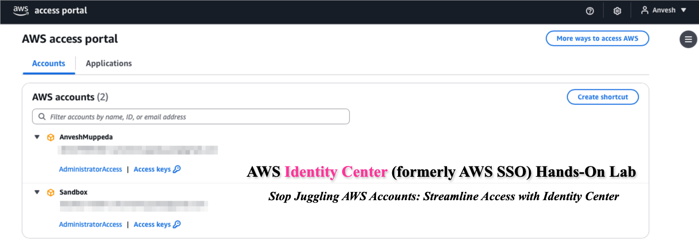

## Prerequisites

- An AWS account with administrative privileges
- Basic understanding of AWS services and IAM concepts
- Access to the AWS Management Console

## Learning Objectives

After completing this lab, you will be able to:
- Enable and configure AWS Identity Center
- Create users and groups in AWS Identity Center
- Set up permission sets with appropriate access levels
- Assign users and groups to AWS accounts
- Create and manage multiple AWS accounts within an organization
- Test and validate access through the AWS access portal

---

## Part 1: Initial Setup and Configuration

### Step 1: Enable AWS Identity Center

1. Sign in to the AWS Management Console with administrative privileges
2. Navigate to **AWS Identity Center** service
3. Select the **us-east-1** region (Note: AWS Identity Center can only be enabled in one region per organization)
4. Click **Enable AWS Identity Center**
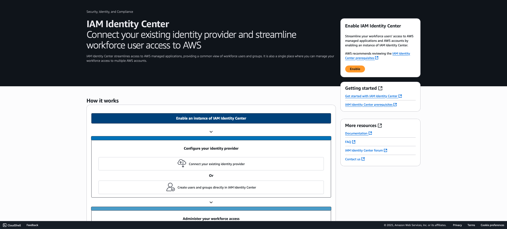

### Step 2: Verify AWS Identity Center Setup

1. Confirm that AWS Identity Center is successfully enabled
2. Note the automatically generated **AWS access portal URL** (format: `https://d-xxxxxxxxxx.awsapps.com/start`)
3. Record this URL as you'll need it for user access later

### Step 3: Verify AWS Organizations Creation

1. Navigate to **AWS Organizations** in the console
2. Verify that an organization has been automatically created
3. Confirm your current account is set as the management account
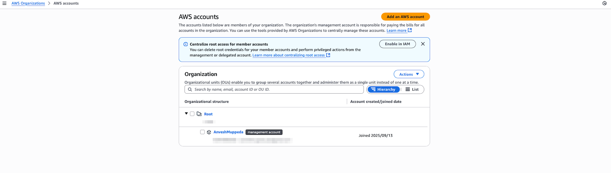

### Step 4: Configure Identity Source

1. In AWS Identity Center, navigate to **Settings** → **Identity source**
2. Verify the default identity source is set to "AWS Identity Center"
3. **Note**: This allows you to create users and groups directly within AWS Identity Center

> **Alternative Options**: You can connect external identity providers such as Microsoft Active Directory or SAML 2.0 compatible IdPs. However, changing the identity source will delete all existing AWS Identity Center users and groups.

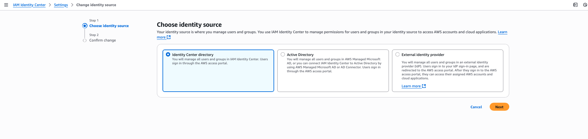

---

## Part 2: User and Group Management

### Step 5: Create Your First User

1. Navigate to **Users** in the AWS Identity Center console
2. Click **Add user**
3. Fill in the user details:
   - **Username**: `anvesh.muppeda` (or your preferred username)
   - **Email address**: Enter a valid email
   - **First name** and **Last name**: Fill as appropriate
4. Click **Next** and review the details
5. Click **Add user**

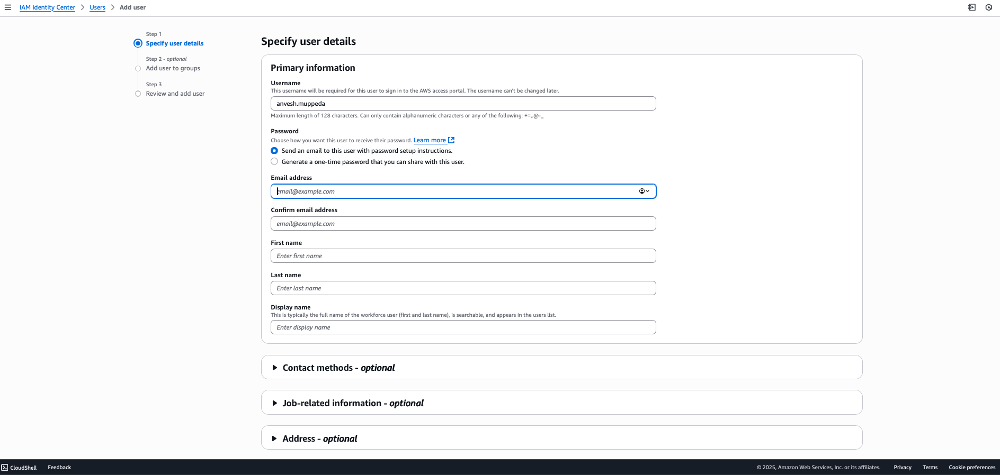

**Important Information Captured**:
- AWS access portal URL: `https://d-xxxxxxxxxx.awsapps.com/start`
- Username: `anvesh.muppeda`
- One-time password: (auto-generated, can be changed during first login)

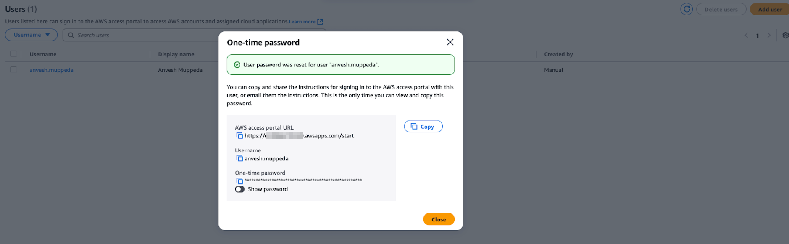

### Step 6: Create an Admin Group

1. Navigate to **Groups** in the AWS Identity Center console
2. Click **Create group**
3. Enter group details:
   - **Group name**: `Admin`
   - **Description**: `Administrator group with full access privileges`
4. Click **Create group**
5. Select the newly created **Admin** group
6. Click **Add users to group**
7. Select the user created in Step 5 (`anvesh.muppeda`)
8. Click **Add users**

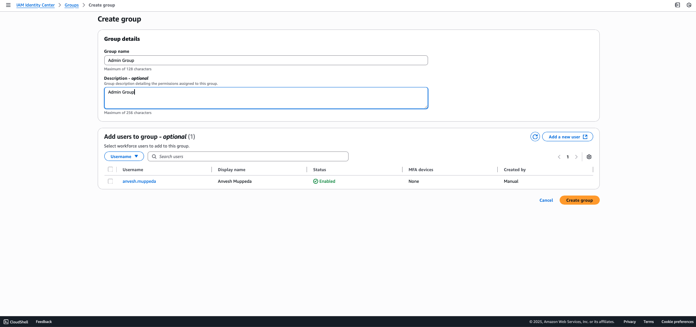

---

## Part 3: Permission Sets and Access Management

### Step 7: Create an Admin Permission Set

1. Navigate to **Permission sets** in the AWS Identity Center console
2. Click **Create permission set**
3. Select **Predefined permission set**
4. Choose **AdministratorAccess** from the dropdown
5. Configure session duration:
   - **Default**: 1 hour
   - **Maximum**: 12 hours (adjust as needed for your security requirements)
6. Click **Next** and review the configuration
7. Click **Create**

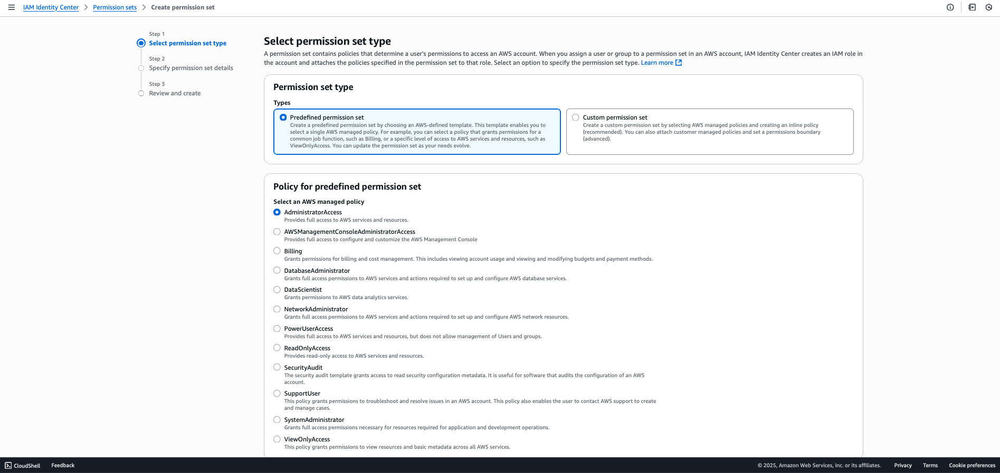
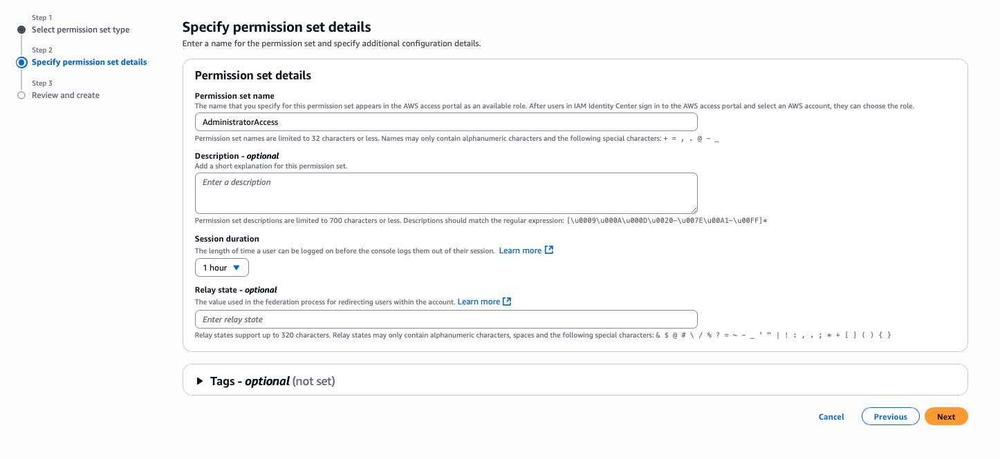

### Step 8: Assign Account Access

1. Navigate to **AWS accounts** in the AWS Identity Center console
2. Select your **management account**
3. Click **Assign users or groups**
4. On the **Users and groups** tab, select the **Admin** group
5. Click **Next**
6. On the **Permission sets** tab, select the **AdministratorAccess** permission set
7. Click **Next**, review the assignment, and click **Submit**

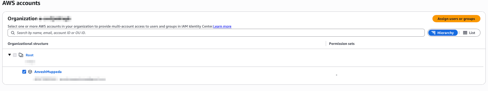
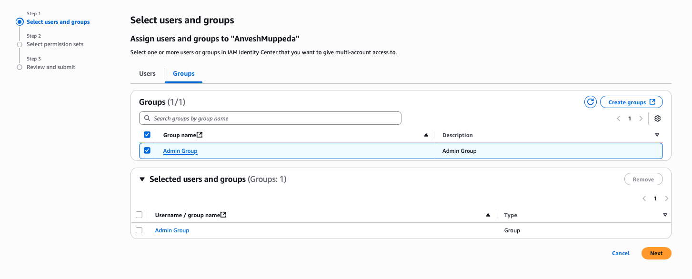
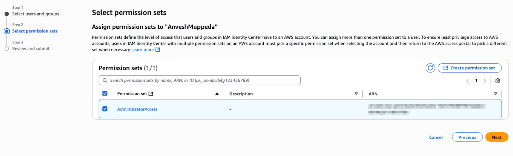

---

## Part 4: Testing and Validation

### Step 9: Test User Access

1. Open a new **incognito/private browser window**
2. Navigate to your AWS access portal URL: `https://d-xxxxxxxxxx.awsapps.com/start`
3. Enter the login credentials:
   - **Username**: `anvesh.muppeda`
   - **Password**: Use the one-time password provided during user creation
4. **First-time login process**:
   - You'll be prompted to change the password
   - Create a strong, secure password
   - Complete any additional security setup if prompted

### Step 10: Verify Console Access

1. After successful authentication, you should see available AWS accounts
2. Click on **Management account**
3. Click **Management console** to access the AWS Management Console
4. Verify you have **AdministratorAccess** permissions by checking various services

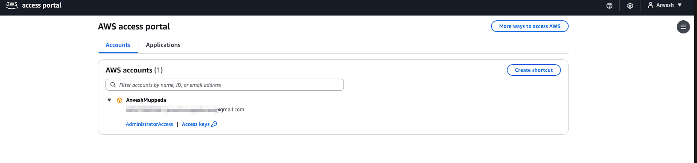

---

## Part 5: Expanding Your Organization

### Step 11: Create a New AWS Account

1. Navigate to **AWS Organizations** in the management console
2. Click **AWS accounts** from the left navigation
3. Click **Add an AWS account**
4. Select **Create an AWS account**
5. Fill in the required information:
   - **AWS account name**: Choose a descriptive name (e.g., "Development Account")
   - **Email address**: Use a unique email address for this account
   - **IAM role name**: Leave default or customize as needed
6. Click **Create AWS account**
7. Wait for the account creation process to complete (this may take a few minutes)

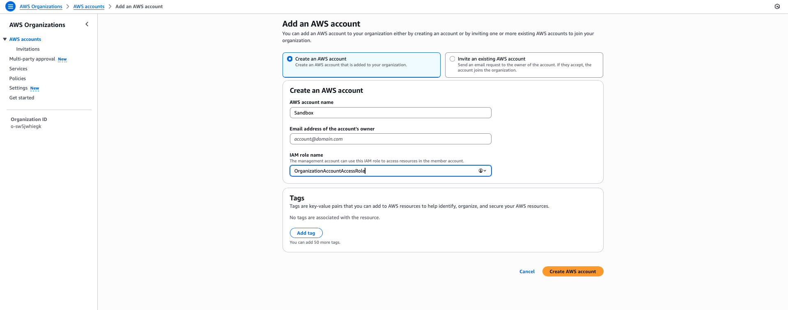

### Step 12: Assign Access to the New Account

1. Return to **AWS Identity Center** console
2. Navigate to **AWS accounts**
3. Locate and select the newly created AWS account
4. Click **Assign users or groups**
5. Select the **Admin** group
6. Click **Next**
7. Select the **AdministratorAccess** permission set
8. Click **Next**, review, and click **Submit**

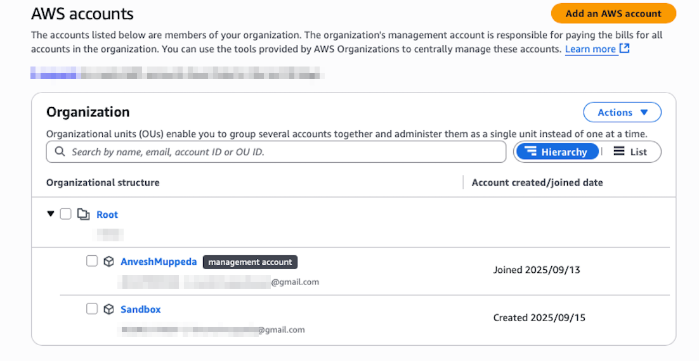

### Step 13: Test Multi-Account Access

1. Open a new incognito window and navigate to the AWS access portal
2. Log in with your user credentials (`anvesh.muppeda`)
3. You should now see **both AWS accounts** listed:
   - Management account
   - Your newly created account
4. Test access to both accounts by clicking on each and selecting **Management console**
5. Verify you have appropriate permissions in both environments

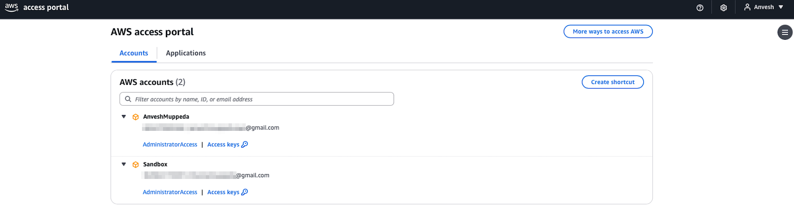

---

## Best Practices and Security Considerations

### User Management
- Use descriptive usernames and group names
- Regularly review and audit user access
- Implement the principle of least privilege
- Set appropriate session durations based on security requirements

### Permission Sets
- Create role-based permission sets rather than user-specific ones
- Use AWS managed policies when possible
- Regularly review and update permissions
- Document the purpose of each permission set

### Account Organization
- Use descriptive account names that reflect their purpose
- Implement a consistent naming convention
- Consider using organizational units (OUs) for better account grouping
- Set up appropriate service control policies (SCPs) as needed

## Troubleshooting Common Issues

### Login Problems
- Verify the correct AWS access portal URL
- Ensure the user account is active and assigned to appropriate groups
- Check if password reset is needed

### Permission Issues
- Verify permission sets are correctly assigned
- Check if the session has expired
- Confirm the user is a member of the correct groups

### Account Access Issues
- Ensure the account is properly assigned to users/groups
- Verify the permission set allows the required actions
- Check AWS Organizations settings for any restrictions

## Conclusion

You have successfully set up AWS Identity Center with multi-account access management. This foundation allows you to:

- Centrally manage user identities and access
- Provide secure, role-based access to multiple AWS accounts
- Streamline the user experience with single sign-on capabilities
- Maintain security best practices across your AWS organization

## Next Steps

Consider exploring these advanced features:
- Integration with external identity providers
- Custom permission sets for specific roles
- Application assignments for SaaS applications
- Advanced session and access policies
- Automated user provisioning with SCIM

---

*This lab guide provides a solid foundation for AWS Identity Center implementation. Always follow your organization's security policies and compliance requirements when implementing identity management solutions.*