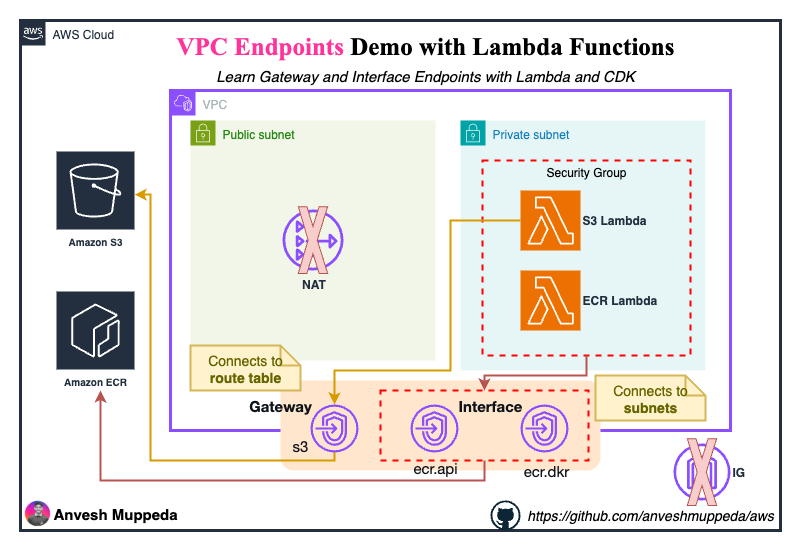

# VPC Endpoints Demo with Lambda Functions

A hands-on AWS CDK project demonstrating how Lambda functions in private subnets can access AWS services (S3 and ECR) using VPC Endpoints instead of NAT Gateways, significantly reducing costs while maintaining security.

## 📚 Table of Contents
- [Purpose](#purpose)
- [Architecture](#architecture)
- [What You'll Learn](#what-youll-learn)
- [Prerequisites](#prerequisites)
- [Project Structure](#project-structure)
- [Deployment Guide](#deployment-guide)
- [Testing the Stack](#testing-the-stack)
- [Understanding VPC Endpoints](#understanding-vpc-endpoints)
- [Cost Comparison](#cost-comparison)
- [Cleanup](#cleanup)
- [Troubleshooting](#troubleshooting)

## 🎯 Purpose

This project demonstrates a cost-effective approach to enabling Lambda functions in private subnets to access AWS services without using expensive NAT Gateways. By using VPC Endpoints, you can:

- **Save costs**: Eliminate NAT Gateway charges (~$32/month + data transfer)
- **Improve security**: Keep traffic within AWS network
- **Enhance performance**: Direct connectivity to AWS services
- **Learn hands-on**: Understand VPC Endpoints through practical examples

## 🏗️ Architecture



### Key Components

1. **VPC**: Custom VPC (10.10.0.0/16) with DNS support enabled
2. **Subnets**:
   - Public Subnet (10.10.0.0/24) - with Internet Gateway
   - Private Subnet (10.10.10.0/24) - isolated, no internet access
3. **Lambda Functions**:
   - S3 Lambda - Tests S3 connectivity via Gateway Endpoint
   - ECR Lambda - Tests ECR connectivity via Interface Endpoints
4. **VPC Endpoints**:
   - S3 Gateway Endpoint (Free)
   - ECR API Interface Endpoint (~$7.30/month)
   - ECR Docker Interface Endpoint (~$7.30/month)
5. **Security Groups**:
   - Lambda SG - Allows all outbound traffic
   - VPC Endpoint SG - Allows traffic from Lambda SG

## 🎓 What You'll Learn

By working through this project, you'll understand:

1. **VPC Endpoints Fundamentals**
   - Difference between Gateway and Interface endpoints
   - When to use each type
   - Cost implications

2. **Network Architecture**
   - Private subnet design without NAT Gateway
   - Security group configurations
   - Route table management

3. **Lambda in VPC**
   - Deploying Lambda in private subnets
   - Configuring Lambda security groups
   - IAM roles and permissions

4. **Hands-on Testing**
   - Validating S3 connectivity
   - Testing ECR access
   - Reading CloudWatch logs

## 📋 Prerequisites

Before you begin, ensure you have:

- **AWS Account** with appropriate permissions
- **AWS CLI** installed and configured
- **AWS CDK** installed (`npm install -g aws-cdk`)
- **Python 3.13** or compatible version
- **Node.js** (for CDK)
- **Git** (optional, for cloning)

### Install AWS CDK
```bash
npm install -g aws-cdk
cdk --version
```

### Configure AWS CLI
```bash
aws configure
# Enter your AWS Access Key ID, Secret Access Key, Region, and Output format
```

## 📁 Project Structure

```
vpc-endpoints/
├── README.md
├── app.py                          # CDK app entry point
├── cdk.json                        # CDK configuration
├── requirements.txt                # Python dependencies
├── vpc_endpoints/
│   └── vpc_endpoints_stack.py     # Main stack definition
└── lambda/
    ├── s3/
    │   └── index.py               # S3 test Lambda
    └── ecr/
        └── index.py               # ECR test Lambda
```

## 🚀 Deployment Guide

### Step 1: Clone or Create Project
```bash
git clone https://github.com/anveshmuppeda/aws.git
cd cdk/python/vpc-endpoints
```
If starting from scratch:
```bash
mkdir vpc-endpoints-demo
cd vpc-endpoints-demo
```

### Step 2: Set Up Python Environment

```bash
# Create virtual environment
python3 -m venv .venv

# Activate virtual environment
# On macOS/Linux:
source .venv/bin/activate
# On Windows:
.venv\Scripts\activate

# Install dependencies
pip install -r requirements.txt
```

### Step 3: Create Lambda Function Code

Create the directory structure:
```bash
mkdir -p lambda/s3
mkdir -p lambda/ecr
```

**Create `lambda/s3/index.py`**:
```python
import json
import boto3
from botocore.exceptions import ClientError

def lambda_handler(event, context):
    """Test S3 connectivity via VPC Gateway Endpoint"""
    s3_client = boto3.client('s3')
    
    try:
        # List S3 buckets
        response = s3_client.list_buckets()
        buckets = [bucket['Name'] for bucket in response.get('Buckets', [])]
        
        print(f"✓ Successfully connected to S3!")
        print(f"✓ Found {len(buckets)} buckets")
        
        return {
            'statusCode': 200,
            'body': json.dumps({
                'message': 'S3 connectivity successful via VPC Gateway Endpoint',
                'bucket_count': len(buckets),
                'buckets': buckets[:5]  # First 5 buckets
            }, indent=2)
        }
        
    except ClientError as e:
        print(f"✗ Failed to connect to S3: {e}")
        return {
            'statusCode': 500,
            'body': json.dumps({
                'error': str(e),
                'message': 'Failed to connect to S3'
            })
        }
```

**Create `lambda/ecr/index.py`**:
```python
import json
import boto3
from botocore.exceptions import ClientError

def lambda_handler(event, context):
    """Test ECR connectivity via VPC Interface Endpoints"""
    ecr_client = boto3.client('ecr')
    
    try:
        # List ECR repositories
        response = ecr_client.describe_repositories(maxResults=10)
        repositories = response.get('repositories', [])
        
        print(f"✓ Successfully connected to ECR!")
        print(f"✓ Found {len(repositories)} repositories")
        
        repo_list = [
            {
                'name': repo['repositoryName'],
                'uri': repo['repositoryUri']
            }
            for repo in repositories
        ]
        
        return {
            'statusCode': 200,
            'body': json.dumps({
                'message': 'ECR connectivity successful via VPC Interface Endpoints',
                'repository_count': len(repositories),
                'repositories': repo_list
            }, indent=2)
        }
        
    except ClientError as e:
        print(f"✗ Failed to connect to ECR: {e}")
        return {
            'statusCode': 500,
            'body': json.dumps({
                'error': str(e),
                'message': 'Failed to connect to ECR'
            })
        }
```

### Step 4: Bootstrap CDK (First Time Only)

```bash
cdk bootstrap aws://ACCOUNT-ID/REGION
```

Replace `ACCOUNT-ID` with your AWS account ID and `REGION` with your target region (e.g., us-east-1).

### Step 5: Synthesize CloudFormation Template

```bash
cdk synth
```

This generates the CloudFormation template. Review it to understand what will be created.

### Step 6: Deploy the Stack

```bash
cdk deploy
```

You'll see a summary of resources to be created. Type `y` to confirm.

**Deployment time**: Approximately 3-5 minutes

**Expected output**:
```
✅  VpcEndpointsStack

✨  Deployment time: 234.56s

Outputs:
VpcEndpointsStack.S3FunctionName = vpc-endpoints-demo-s3-lambda-function
VpcEndpointsStack.ECRFunctionName = vpc-endpoints-demo-ecr-lambda-function

Stack ARN:
arn:aws:cloudformation:us-east-1:123456789012:stack/VpcEndpointsStack/...
```

## 🧪 Testing the Stack

### Test 1: S3 Lambda Function

The S3 Lambda tests connectivity to S3 via the Gateway Endpoint.

#### Using AWS CLI:
```bash
aws lambda invoke \
  --function-name vpc-endpoints-demo-s3-lambda-function \
  --payload '{}' \
  response.json

cat response.json | jq '.'
```

#### Using AWS Console:
1. Go to **Lambda Console**
2. Select `vpc-endpoints-demo-s3-lambda-function`
3. Click **Test** tab
4. Create a new test event (use default empty JSON `{}`)
5. Click **Test**

#### Expected Success Output:
```json
{
  "statusCode": 200,
  "body": {
    "message": "S3 connectivity successful via VPC Gateway Endpoint",
    "bucket_count": 5,
    "buckets": [
      "my-bucket-1",
      "my-bucket-2",
      "my-bucket-3"
    ]
  }
}
```

#### Check CloudWatch Logs:
```bash
aws logs tail /aws/lambda/vpc-endpoints-demo-s3-lambda-function --follow
```

### Test 2: ECR Lambda Function

The ECR Lambda tests connectivity to ECR via Interface Endpoints.

#### Using AWS CLI:
```bash
aws lambda invoke \
  --function-name vpc-endpoints-demo-ecr-lambda-function \
  --payload '{}' \
  response.json

cat response.json | jq '.'
```

#### Using AWS Console:
1. Go to **Lambda Console**
2. Select `vpc-endpoints-demo-ecr-lambda-function`
3. Click **Test** tab
4. Create a new test event (use default empty JSON `{}`)
5. Click **Test**

#### Expected Success Output:
```json
{
  "statusCode": 200,
  "body": {
    "message": "ECR connectivity successful via VPC Interface Endpoints",
    "repository_count": 2,
    "repositories": [
      {
        "name": "my-app",
        "uri": "123456789012.dkr.ecr.us-east-1.amazonaws.com/my-app"
      }
    ]
  }
}
```

**Note**: If you don't have any ECR repositories, the count will be 0, which is normal.

#### Check CloudWatch Logs:
```bash
aws logs tail /aws/lambda/vpc-endpoints-demo-ecr-lambda-function --follow
```

### Test 3: Verify VPC Endpoints

#### Check S3 Gateway Endpoint:
```bash
aws ec2 describe-vpc-endpoints \
  --filters "Name=service-name,Values=com.amazonaws.us-east-1.s3" \
  --query 'VpcEndpoints[*].[VpcEndpointId,ServiceName,State]' \
  --output table
```

#### Check ECR Interface Endpoints:
```bash
aws ec2 describe-vpc-endpoints \
  --filters "Name=service-name,Values=com.amazonaws.us-east-1.ecr.*" \
  --query 'VpcEndpoints[*].[VpcEndpointId,ServiceName,State]' \
  --output table
```

### Test 4: Verify Security Groups

#### Lambda Security Group:
```bash
aws ec2 describe-security-groups \
  --filters "Name=group-name,Values=vpc-endpoints-demo-lambda-sg" \
  --query 'SecurityGroups[*].[GroupId,GroupName,IpPermissionsEgress]' \
  --output json
```

#### VPC Endpoint Security Group:
```bash
aws ec2 describe-security-groups \
  --filters "Name=group-name,Values=vpc-endpoints-demo-ecr-endpoint-sg" \
  --query 'SecurityGroups[*].[GroupId,GroupName,IpPermissions]' \
  --output json
```

## 📊 Understanding VPC Endpoints

### Gateway Endpoints vs Interface Endpoints

| Feature | Gateway Endpoint | Interface Endpoint |
|---------|------------------|-------------------|
| **Services** | S3, DynamoDB | Most AWS services (ECR, SNS, SQS, etc.) |
| **Technology** | Route table entry | Elastic Network Interface (ENI) |
| **Cost** | **FREE** | ~$0.01/hour (~$7.30/month) + data processing |
| **Private IP** | No | Yes (in your subnet) |
| **Security Groups** | Not supported | Supported |
| **DNS** | Uses public DNS | Can use private DNS |
| **Access Method** | Route table routing | ENI with private IP |

### How S3 Gateway Endpoint Works

1. Lambda makes request to S3 (e.g., `s3.us-east-1.amazonaws.com`)
2. VPC route table has entry: `pl-xxxxx (S3 prefix list) → vpce-xxxxx`
3. Traffic routes directly to S3 via AWS private network
4. **No internet, no NAT Gateway needed**

### How ECR Interface Endpoints Work

1. Lambda makes request to ECR (e.g., `api.ecr.us-east-1.amazonaws.com`)
2. Private DNS resolves to ENI private IP (10.10.10.x)
3. Traffic goes to ENI in private subnet
4. ENI forwards to ECR via AWS PrivateLink
5. **All traffic stays within AWS network**

## 💰 Cost Comparison

### Traditional Approach (with NAT Gateway)

| Resource | Monthly Cost |
|----------|-------------|
| NAT Gateway | ~$32.40 |
| Data Processing (10GB) | ~$0.45 |
| **Total** | **~$32.85/month** |

### VPC Endpoints Approach (This Project)

| Resource | Monthly Cost |
|----------|-------------|
| S3 Gateway Endpoint | **$0.00** (Free) |
| ECR API Interface Endpoint | ~$7.30 |
| ECR Docker Interface Endpoint | ~$7.30 |
| Data Processing (10GB) | ~$0.10 |
| **Total** | **~$14.70/month** |

**Savings: ~$18/month (55% cost reduction)**

### When to Use Each Approach

**Use VPC Endpoints when:**
- Lambda only needs to access specific AWS services
- Cost optimization is important
- Traffic should stay within AWS network
- You need better performance (lower latency)

**Use NAT Gateway when:**
- Lambda needs to access the internet
- Lambda needs to access third-party APIs
- You need to access multiple AWS services (endpoints add up)
- You have high data transfer requirements

## 🧹 Cleanup

To avoid ongoing charges, delete the stack when you're done testing.

### Option 1: Using CDK

```bash
cdk destroy
```

Type `y` to confirm deletion.

### Option 2: Using AWS Console

1. Go to **CloudFormation Console**
2. Select `VpcEndpointsStack`
3. Click **Delete**
4. Confirm deletion

### Option 3: Using AWS CLI

```bash
aws cloudformation delete-stack --stack-name VpcEndpointsStack
```

### Verify Deletion

Wait a few minutes, then verify:

```bash
aws cloudformation describe-stacks --stack-name VpcEndpointsStack
```

You should see: `Stack with id VpcEndpointsStack does not exist`

### Resources Deleted

The following resources will be automatically deleted:
- VPC and all subnets
- Internet Gateway
- Route tables and associations
- Security groups
- Lambda functions
- VPC Endpoints (S3, ECR API, ECR Docker)
- IAM roles and policies
- CloudWatch Log Groups

**Note**: Some resources like CloudWatch Logs may take a few extra minutes to delete.

## 🔧 Troubleshooting

### Lambda Timeout Error

**Symptom**: Lambda function times out after 10 seconds

**Possible Causes**:
1. VPC Endpoint not created properly
2. Security group blocking traffic
3. Route table not configured correctly

**Solutions**:

#### Check VPC Endpoints exist:
```bash
aws ec2 describe-vpc-endpoints --output table
```

#### Verify Security Groups:
```bash
# Lambda SG should allow all outbound
aws ec2 describe-security-groups \
  --filters "Name=group-name,Values=vpc-endpoints-demo-lambda-sg"

# VPC Endpoint SG should allow inbound from Lambda SG
aws ec2 describe-security-groups \
  --filters "Name=group-name,Values=vpc-endpoints-demo-ecr-endpoint-sg"
```

#### Check Route Table:
```bash
aws ec2 describe-route-tables \
  --filters "Name=tag:Name,Values=vpc-endpoints-demo-private-rt"
```

### S3 Access Denied

**Symptom**: Lambda returns 403 Forbidden when accessing S3

**Solution**: Verify Lambda IAM role has S3 permissions:
```bash
aws iam get-role --role-name VpcEndpointsStack-LambdaExecutionRole*
```

The role should have `AmazonS3ReadOnlyAccess` policy attached.

### ECR Repository Not Found

**Symptom**: ECR Lambda returns empty list

**This is normal!** If you don't have any ECR repositories, the function will return:
```json
{
  "repository_count": 0,
  "repositories": []
}
```

**To create a test repository**:
```bash
aws ecr create-repository --repository-name test-repo
```

### Private DNS Not Resolving

**Symptom**: ECR endpoint DNS not resolving to private IP

**Solution**: Ensure VPC has DNS support enabled:
```bash
aws ec2 describe-vpc-attribute \
  --vpc-id vpc-xxxxx \
  --attribute enableDnsHostnames

aws ec2 describe-vpc-attribute \
  --vpc-id vpc-xxxxx \
  --attribute enableDnsSupport
```

Both should return `true`.

### CloudWatch Logs Not Appearing

**Solution**: Wait 1-2 minutes after Lambda execution, then check:
```bash
aws logs describe-log-groups --log-group-name-prefix /aws/lambda/vpc-endpoints-demo
```

## 📝 Additional Resources

### AWS Documentation
- [VPC Endpoints](https://docs.aws.amazon.com/vpc/latest/privatelink/vpc-endpoints.html)
- [Gateway Endpoints](https://docs.aws.amazon.com/vpc/latest/privatelink/gateway-endpoints.html)
- [Interface Endpoints](https://docs.aws.amazon.com/vpc/latest/privatelink/vpce-interface.html)
- [Lambda in VPC](https://docs.aws.amazon.com/lambda/latest/dg/configuration-vpc.html)

### AWS CDK
- [CDK Python Reference](https://docs.aws.amazon.com/cdk/api/v2/python/)
- [EC2 Module](https://docs.aws.amazon.com/cdk/api/v2/python/aws_cdk.aws_ec2.html)
- [Lambda Module](https://docs.aws.amazon.com/cdk/api/v2/python/aws_cdk.aws_lambda.html)

### Best Practices
- [VPC Best Practices](https://docs.aws.amazon.com/vpc/latest/userguide/vpc-security-best-practices.html)
- [Lambda Best Practices](https://docs.aws.amazon.com/lambda/latest/dg/best-practices.html)
- [Cost Optimization](https://aws.amazon.com/architecture/cost-optimization/)

## 🎯 Next Steps

After completing this hands-on guide, consider:

1. **Extend the Demo**:
   - Add more VPC endpoints (DynamoDB, SNS, SQS)
   - Create Lambda functions that write to S3
   - Set up VPC Flow Logs to analyze traffic

2. **Production Considerations**:
   - Implement VPC endpoint policies for fine-grained access control
   - Use multiple Availability Zones for high availability
   - Add CloudWatch alarms for monitoring
   - Implement Infrastructure as Code best practices

3. **Write a Blog Post**:
   - Share your learnings on Medium
   - Include architecture diagrams
   - Add cost comparison charts
   - Provide real-world use cases

## 🤝 Contributing

Found an issue or want to improve this guide? Feel free to:
- Open an issue
- Submit a pull request
- Share your feedback

## 📄 License

This project is provided as-is for educational purposes.

## ⭐ Acknowledgments

Special thanks to the AWS community and CDK team for making infrastructure as code accessible and powerful.

---

**Happy Learning! 🚀**

If you found this guide helpful, please consider:
- ⭐ Starring the repository
- 📝 Writing about your experience
- 🔗 Sharing with others learning AWS

---

**Questions or Issues?**
Feel free to open an issue or reach out to the community for help!